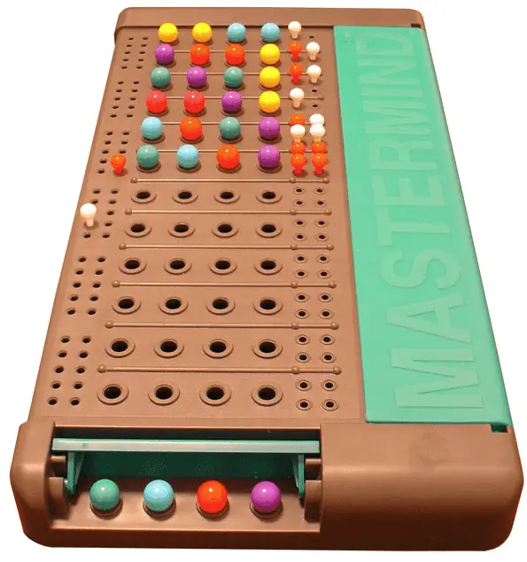
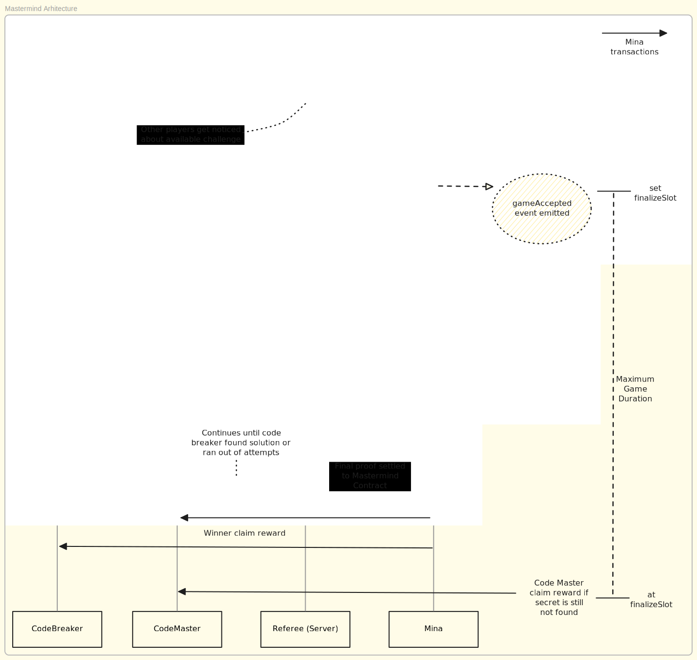

[](https://github.com/navigators-exploration-team/recursive-mastermind-zkApp/actions/workflows/ci.yml)

# Mina Mastermind



# Table of Contents

- [Understanding the Mastermind Game](#understanding-the-mastermind-game)

  - [Overview](#overview)
  - [Game Rules](#game-rules)

- [Mastermind zkApp Structure](#mastermind-zkapp-structure)

  - [Mastermind States](#mastermind-states)
    - [turnCountMaxAttemptsIsSolved](#turncountmaxattemptsissolved)
    - [codemasterId & codebreakerId](#codemasterid--codebreakerid)
    - [refereeId](#refereeid)
    - [solutionHash](#solutionhash)
    - [packedGuessHistory](#packedguesshistory)
    - [packedClueHistory](#packedcluehistory)
    - [rewardFinalizeSlot](#rewardfinalizeslot)
  - [Mastermind Methods](#mastermind-methods)
    - [initGame](#initgame)
    - [submitGameProof](#submitgameproof)
    - [claimReward](#claimreward)
    - [forfeitWin](#forfeitwin)
    - [makeGuess](#makeguess)
    - [giveClue](#giveclue)

- [Step Program](#step-program)

  - [Step Program Public Inputs](#step-program-public-inputs)
  - [Step Program Public Outputs](#step-program-public-outputs)
  - [Step Program Methods](#step-program-methods)
    - [createGame](#creategame)
    - [makeGuess](#makeguess)
    - [giveClue](#giveclue)

- [Project Structure](#project-structure)

- [How to Build & Test](#how-to-build--test)

  - [How to build](#how-to-build)
  - [How to run tests](#how-to-run-tests)
  - [How to run coverage](#how-to-run-coverage)

- [License](#license)

# Understanding the Mastermind Game

## Overview

- The game involves two players: a `Code Master` and a `Code Breaker`.
- Inspired by [mastermind-noir](https://github.com/vezenovm/mastermind-noir), this version replaces colored pegs with a combination of 4 unique, non-zero digits between `1` and `7`.

## Game Rules

- The Code Master hosts a game and sets a secret combination for the Code Breaker to guess.

- The Code Breaker makes a guess and waits for the Code Master to provide a clue.

- The clue indicates the following:

  - **Hits**: Digits that are correctly guessed and in the correct position.
  - **Blows**: Digits that are correct but in the wrong position.

  Example:

  |        | P1  | P2  | P3  | P4  |
  | ------ | --- | --- | --- | --- |
  | Secret | 5   | 9   | 3   | 4   |
  | Guess  | 5   | 7   | 8   | 9   |

  |      | Hits | Blows |
  | ---- | ---- | ----- |
  | Clue | 1    | 1     |

  - Code Master's secret combination: **5 9 3 4**
  - Code Breaker's guess: **5 7 8 9**
  - Result: `1` hit and `1` blow.
    - The hit is `5` in the first position.
    - The blow is `9` in the fourth position.

- The game continues with alternating guesses and clues until the Code Breaker achieves 4 hits and uncovers the secret combination or fails to do so within the **maximum allowed attempts = 7**.

# Mastermind zkApp Structure

Following the game rules, the [MastermindZkApp](./src/Mastermind.ts) should be deployed:

- The game master uses the `initGame` method to set the secret of the game, set referee public key, set the reward amount for solving the game and send it to the contract. This method takes these parameters:

  - `secretCombination`: The secret combination set by the Code Master.
  - `salt`: A random field to salt the secret combination before hashing.
  - `refereePubKey`: The public key of the referee who will penalize misbehaving players.
  - `rewardAmount`: The amount of tokens to be rewarded to the codeBreaker upon solving the game.

- The initiated game is accepted by another player using the `acceptGame` method, the player becomes a _code breaker_ by depositing a reward equal to the amount deposited by the game master and the game starts. Additionally, a finalize slot is determined to set the maximum end time of the game.

- After the game is started, players continue playing the game until the `finalize slot` is reached, either by using recursion with `StepProgram` along with the `StepProgramProof` they generated off-chain, or by using the `makeGuess` method for the code breaker and the `giveClue` method for the code master.

- The Code Master submits the solution again to be checked against the previous guess and provides a clue.

- The Code Breaker should analyze the given clue and make another meaningful guess.

- The game continues by alternating between `makeGuess` and `giveClue` methods until the Code Breaker either uncovers the secret combination or fails by exceeding the allowed `MAX_ATTEMPT = 7`, concluding the game.



Now, let's dive deeper into the states and methods of our Mastermind zkApp.

## Mastermind States

The Mastermind zkApp uses all 8 available states.

### compressedState

- The `compressedState` is a packed state variable that uses `GameState` class to compress and decompress the state variable.
- The `GameState` class contains the following states:
  - `rewardAmount` **(UInt64)** - the amount of tokens to be rewarded to the winner.
  - `finalizeSlot` **(UInt32)** - the slot number when the game is hard finalized.
  - `turnCount` **(UInt8)** - the number of turns taken in the game.
  - `isSolved` **(Bool)** - indicates whether the secret combination has been solved.

### codemasterId & codebreakerId

- These states represent the unique identifiers of the players, which are stored as the **hash** of their `PublicKey`.

- Player identifiers are crucial for correctly associating each method call with the appropriate player, such as linking `makeGuess` to the Code Breaker and `giveClue` to the Code Master and `claimReward` to the winner.

### refereeId

- This state represents the unique identifier of the referee, stored as the **hash** of their `PublicKey`.

- The referee is responsible for penalizing misbehaving players, ensuring fair play.

### solutionHash

- The solution must remain private; otherwise, the game loses its purpose. Therefore, whenever the Code Master provides a clue, they should enter the `secretCombination` as a method parameter.

- To maintain the integrity of the solution, the solution is hashed and stored on-chain when the game is first created.

- Each time the Code Master calls the `giveClue` method, the entered private secret combination is salted, hashed, and compared against the `solutionHash` stored on-chain. This process ensures the integrity of the combination and helps prevent side-channel attacks.

- **Note:** Unlike player IDs, where hashing is used for data compression, here it is used to preserve the privacy of the on-chain state and to ensure the integrity of the values entered privately with each method call.

### packedGuessHistory

- This state is a compressed state variable that stores the history of all guesses made by the Code Breaker. It uses `Combination` class to compress the state by using `updateHistory` method.

- Each guess is represented as a single `Field` value, with the four digits packed into one `Field` with bit manipulation.
- Each digit is represented as a 3-bit number, allowing for a range of `1` to `7`. The digits are combined and stored on-chain as a `12-bit * MAX_ATTEMPT` field in decimal.

### packedClueHistory

- This state is a compressed state variable that stores the history of all clues given by the Code Master. It uses `Clue` class to compress the state by using `updateHistory` method.

- Each clue is represented as a two `Field` value, with the hits and blows packed into one `Field` with bit manipulation.
- Each clue is represented as a 3-bit number, allowing for a range of `0` to `4`. The hits and blows are combined and stored on-chain as a `6-bit * MAX_ATTEMPT` field in decimal.

## Mastermind Methods

### initGame

This method should be called **first** and can be called **only once** to initialize the game.

> It is recommended to call this method with the same transaction that deploys the zkApp, due to lower fee and security reasons.

- `initGame` is the first method called to set up the game, initialize the secret combination, define the reward amount for the challenge and the referee's public key. The first user to call this method with valid inputs will be designated as the code master.

- This method takes five arguments:

  - `secretCombination`: The secret combination set by the Code Master.
  - `salt`: A random field to salt the secret combination before hashing.
  - `refereePubKey`: The public key of the referee who will penalize misbehaving players.
  - `rewardAmount`: The amount of tokens to be rewarded to the codeBreaker upon solving the game.

- The method executes successfully when the following conditions are met:

  - The game is not already initialized.
  - The `secretCombination` is validated with the `Combination` class, which separates the digits and checks for uniqueness and `1` to `7` range through the `validate` method.
  - The `rewardAmount` is received from the caller and stored in the contract.
  - The secret combination is then hashed with the salt and stored on-chain as `solutionHash`.

  - The caller's `PublicKey` is hashed and stored on-chain as `codemasterId` once the combination is validated.

  - Finally, the `turnCount` is incremented, signaling that the game is ready for the code breaker to `makeGuess`.

> For simplicity, security checks in this method have been abstracted. For more details, please refer to the [Security Considerations](https://github.com/o1-labs-XT/mastermind-zkApp?tab=readme-ov-file#safeguarding-private-inputs-in-zk-snark-circuits).

---

### submitGameProof

- This method should be called after the game is initialized and the code breaker has accepted the game. The code breaker and the code master should generate a recursive proof off-chain using the `StepProgram` and submit it to the contract using this method.

- This method can be called by anyone who has the valid proof generated by the `StepProgram`.

- The method takes `proof` and `winnerPubKey` as arguments and updates the contract states when the following conditions are met:

  - The game is accepted by the code breaker.
  - The game is not finalized (i.e., the finalize slot has not been reached), and the game is not solved.
  - The given proof is valid and belongs to the current game.
  - The proof has more steps than the current game state (i.e., the proof is not belonging to the previous game state).

- The prize amount will be sent to the winner if the following optional conditions are met:

  - The game is solved (i.e., the code breaker has guessed the secret combination, or exceeded the maximum number of attempts).
  - The provided `winnerPubKey` hash is equal to the calculated winner's hash, which is the code breaker if the game is solved, or the code master if the game is not solved.

  > If the `winnerPubKey` is not provided correctly, the contract will not transfer the reward to the winner, and the winner must call the `claimReward` method to claim their reward.

- The method updates the `turnCount` and `isSolved` states based on the proof provided.
  > `isSolved` is set to `true` if the proof's turn count is not exceeding the max attempts and the game is solved.

### claimReward

- This method should be called after the game is finalized by the code breaker (i.e., the game is solved or the max attempts are reached) or by the code master (i.e., the game is not solved and the finalize slot is reached).

- The method can be called by only the winner of the game, if the following conditions are met contract will transfer the reward to the winner:

  - The game is finalized.
    - For the **code breaker**, the game must be solved within the _max attempts_ and the proof must be submitted before the _finalize slot_.
    - For the **code master**, the game either must not be solved within the _max attempts_ or the _finalize slot_ must be reached without the code breaker solving the game.
  - The caller is the **winner** of the game.

---

### forfeitWin

- This method should be called by the referee to penalize the player who misbehaves during the game. When the player forfeits the game, the reward is transferred to the other player.

- The method can be called by the referee only, taking the `playerPubKey` as an argument. The method updates the contract states when the following conditions are met:

  - The game is accepted by the code breaker.
  - The caller is the referee.
  - The contract still has the reward (i.e., the claimReward method has not been called).
  - The provided `playerPubKey` is either the code master or the code breaker.

> The current situation of the penalty mechanism is simple and trusted. It assumes that the referee is honest and will not penalize the player without a valid reason. In the future, we will explore more advanced mechanisms to penalize players without the need for trust of reputation.

### makeGuess

- This method is not intended to be used in the normal game flow. It is used only for recovery purposes when the code breaker fails to send the proof to code master or server went down before the code master could finalize the game.

- The method can be called by the code breaker only, taking the `guessCombination` as an argument. The method updates the contract states when the following conditions are met:

  - The game is is accepted by the code breaker.
  - The game is not finalized (i.e., the finalize slot has not been reached), and the game is not solved.
  - The caller is the code breaker.
  - The provided `guessCombination` is a valid guess.
  - The `turnCount` is less than or equal the `2 * MAX_ATTEMPT = 14` and **odd** (i.e., it is the code breaker's turn).

- After all the preceding checks pass, the code breaker's guess combination is validated, stored on-chain, and the `turnCount` is incremented. This then awaits the code master to read the guess and provide a clue.

---

### giveClue

- Similar to the `makeGuess` method, there are a few restrictions on calling this method to maintain a consistent progression of the game:

  - The caller is restricted to be only the registered code master.
  - The game must be accepted by the code breaker.
  - The correct sequence is enforced by checking that `turnCount` is non-zero (to avoid colliding with the `createGame` method call) and even.
  - If the game `isSolved`, this method is blocked and cannot be executed.
  - The game must not be finalized (i.e., the finalize slot has not been reached), and the game is not solved.
  - The `turnCount` is less than or equal to `2 * MAX_ATTEMPT = 14` and **even** (i.e., it is the code master's turn).
  - The provided `secretCombination` and `salt` are valid and match the stored `solutionHash`.

- Next, the guess from the previous turn is fetched, separated, and compared against the secret combination digits to provide a clue:

  - The clue is generated with `Clue` class, which compares the digits of the guess and the secret combination and returns the hits and blows.
  - If the clue results in 4 hits the game is marked as solved, and the `isSolved` state is set to `Bool(true)`.

- Finally, the `turnCount` is incremented, making it odd and awaiting the code breaker to deserialize and read the clue before making a meaningful guess—assuming the game is not already solved or has not reached the maximum number of attempts.

---

# Step Program

- The **StepProgram** is a recursive zk-SNARK circuit that allows the Code Breaker and Code Master to generate proofs off-chain and submit them to the zkApp contract.

## Step Program Public Inputs

- `authPubKey`: is the public key of the player who is generating the proof.
- `authSignature`: is the signature of the player who is generating the proof.

## Step Program Public Outputs

- `codeMasterId` and `codeBreakerId`: should be same with the on-chain values of players.
- `solutionHash`: should also be same with the one on-chain value.
- `lastCompressedGuess` and `lastcompressedClue`: are the values obtained from the `makeGuess` and `giveClue` methods, respectively.
- `turnCount`: is the turn count of the game. Even turn counts represent the turns of code master and odd turn counts represent the turn of the code breaker.
- `packedGuessHistory`: is a serialized data that keeps all guesses done so far.
- `packedClueHistory`: is a serialized data that keeps all clues given so far.

## Step Program Methods

### createGame

- This method is called by the Code Master to create a new game proof by setting the secret combination and salt. You can think of this as base case of the recursion.

- The method takes two arguments as **private inputs** besides the public inputs:

  - `secretCombination`: The secret combination set by the Code Master.
  - `salt`: A random field to salt the secret combination before hashing.

- The method returns the _Step Program Proof_ with public outputs of the Step Program, if the following conditions are met:

  - The `secretCombination` is valid as specified in the `initGame` method.
  - The provided signature is valid for the given public key. (Will be saved as `codeMasterId`)

### makeGuess

- This method is called by the Code Breaker to generate a step proof with the guess combination by using recursion.

- The method takes the `guessCombination` and `previous proof` as private inputs besides the public inputs:

  - `guessCombination`: The guess combination made by the Code Breaker.
  - `previousProof`: The previous proof generated by the Code Master.

- The method appends last guess to the `packedGuessHistory` and updates the public outputs of the Step Program, when the following conditions are met:

  - The `previousProof` is valid and belongs to the current game state (i.e., public outputs of the previous proof match the current game state).
  - The provided signature is valid for the given public key.(Will be saved as `codeBreakerId` if the first guess, otherwise it need to be the same with the previous proof's `codeBreakerId`)

### giveClue

- This method is called by the Code Master to generate a step proof with the clue combination by using recursion.

- The method takes the `secretCombination`, `salt` and `previous proof` as private inputs besides the public inputs:

  - `secretCombination`: The secret combination set by the Code Master.
  - `salt`: A random field to salt the secret combination before hashing.
  - `previousProof`: The previous proof generated by the Code Breaker.

- The method appends the serialized clue to the `packedClueHistory` and updates the public outputs of the Step Program, when the following conditions are met:

  - The `previousProof` is valid and belongs to the current game state (i.e., public outputs of the previous proof match the current game state).
  - The provided signature is valid for the given public key.(It need to be the same with the previous proof's `codeMasterId`)
  - The hash of `secretCombination` and `salt` is equal to the `solutionHash` of the previous proof.
  - The `turnCount` is even and greater than zero.

## Project Structure

The `MastermindZkApp` project is organized to enhance clarity, maintainability, and ease of testing. Key files include:

```sh
src/
├──benchmark/
│  └── browser/
│  └── node/
|  └──benchmark.md
├──test/
│  └── Mastermind.test.ts
│  └── mock.ts
│  └── stepProgram.test.ts
│  └── testUtils.test.ts
│  └── testUtils.ts
│  └── utils.test.ts
├── constants.ts
├── index.ts
├── Mastermind.ts
├── stepProgram.ts
└── utils.ts
```

- **`benchmark/`**: Contains benchmarking scripts for the zkApp, which can be run in the browser or NodeJS environment. The `benchmark.md` file provides previous benchmarking results for reference.

- **`test/`**: Contains test files for the zkApp, including unit tests for the zkApp methods, integration tests with using local blockchain, Lightnet and Devnet.

  - **`mock.ts`**: Provides mock private keys and public keys for testing purposes for devnet.

  - **`testUtils.ts`**: Contains reusable utility functions for testing, such as generating step proofs or the proof of the whole game.

  - **`Mastermind.test.ts`**: Contains integration tests using a `localBlockchain`. These tests validate the zkApp’s behavior in various scenarios, ensuring it functions correctly and securely in a simulated environment.

  - **`stepProgram.test.ts`**: Contains unit tests for the `StepProgram` methods, ensuring the zkProgram generates proofs correctly and maintains the game state accurately.

  - **`utils.test.ts`**: Provides unit tests for the functions in `utils.ts`, ensuring each logic component works correctly before integration into the zkApp. This helps catch issues early and improves overall reliability.

  - **`testUtils.test.ts`**: Contains unit tests for the functions in `testUtils.ts`, ensuring each logic component works correctly before integration into the zkApp. This helps catch issues early and improves overall reliability.

- **`constants.ts`**: Contains constants used in the zkApp, such as `MAX_ATTEMPT`, and `PER_ATTEMPT_GAME_DURATION` which are essential for maintaining the game rules and logic.

- **`index.ts`**: Serves as the entry point, importing and exporting all essential smart contract classes for the zkApp(s).

- **`Mastermind.ts`**: The core file where the game logic and blockchain interactions are defined. This ensures that the zkApp's mechanics and state management are clear and maintainable.

- **`stepProgram.ts`**: Contains the `StepProgram` zkProgram, which enables the Code Breaker and Code Master to generate recursive proofs off-chain and submit them to the zkApp contract. This way, the game can be played securely and efficiently without needing to Mina transactions for every turn.

- **`utils.ts`**: Contains reusable utility functions that act as standalone `circuit templates`. By isolating these logic components, the main zkApp code remains focused and uncluttered.

---

For more details refer to the

- [Educational Mastermind repo](https://github.com/o1-labs-XT/mastermind-zkApp)
- [o1js documentation](https://docs.minaprotocol.com/zkapps/o1js)

# How to Build & Test

## How to build

```sh
npm run build
```

## How to run tests

```sh
# default mode in local logs disabled
npm run test

# lightnet mode with logs disabled
TEST_ENV=lightnet LOGS_ENABLED=0 npm run test

# devnet mode with logs enabled
TEST_ENV=devnet LOGS_ENABLED=1 npm run test
```

## How to run benchmark

### For NodeJS

```sh
npm run benchmark
```

### For Browser

```sh
cd src/benchmark/browser
npm install
npm run dev
```

## How to run coverage

```sh
npm run coverage
```

# License

[Apache-2.0](LICENSE)
